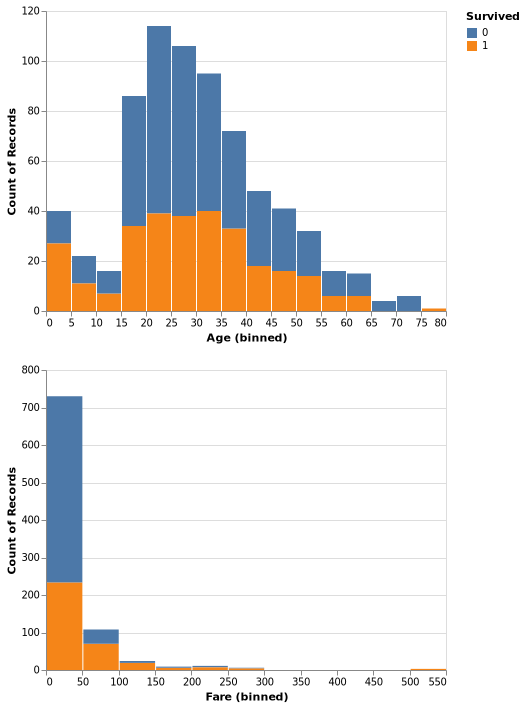
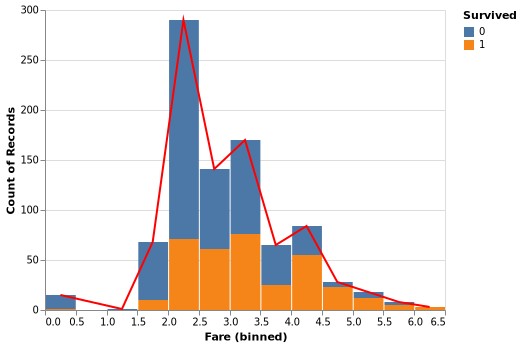
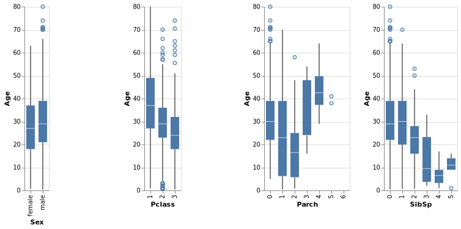
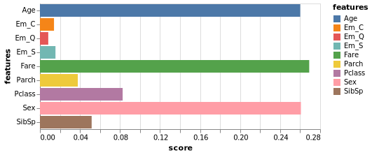
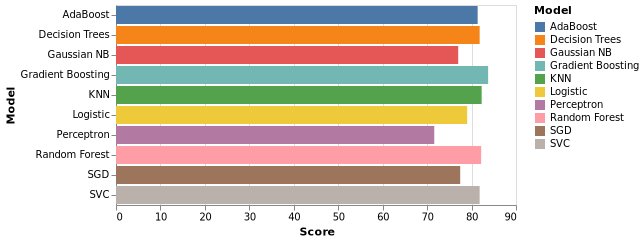

# Approaching a Supervised Machine Learning Problem
This repository is created to give a brief introduction on how to approach a supervised classification problem. Though the problem is classification, the approach can be used for regression problems too.
## Table of Contents  
1. [Goal](#Goal)
2. [Repository Structure](#Repository-Structure)
3. [Usage](#usage)
4. [Note](#note-on-data-visualization)
5. [Approach](#approach)
    1. [EDA](#exploratory-data-analysis)
    2. [Data Pre-processing](#Data-Pre-processing)
    3. [Feature Engineering](#Feature-Engineering)
    4. [ML Models](#Building-supervised-ml-models)
        1. [Which model to choose?](#When-to-choose-which-model?)
## Goal
The aim of this repository is not just to achieve the accuracy using any one model. It's more about how you start with the raw data and what tools can be used to get a final solution. I use this repository more like a **revision material** from time to time as I discussed various techniques to get inputs from the data and go over an exhautive list of machine learning algorithms along with my personal notes explaining the algorithm in laymans terms.
## Repository Structure
```
.
├── Notebook.ipynb
├── README.md
├── environment.yml
├── images
│   ├── Age_fare_count.png
│   ├── age_corr.png
│   ├── fare_gaus.png
│   ├── fea_imp.png
│   └── summary.png
└── train.csv

1 directory, 9 files
```
## Usage
If you want a quick glance, click on the `Notebook.ipynb` which has all the code and outputs with explanations. Or you want to try it on your own, you can download from the github. But I prefer to do it from the command line as I enclosed a `environment.yml` too to give you all the required packages in one shot. The usage steps are:
1. Open your terminal
2. Clone the repoistory using `git clone git@github.com:nvmcr/My_Portfolio.git`.
3. This will create a repository with all my portfolio projects. (sorry if you wanted to clone just the present repo)
4. Enter the present repo using `cd Approaching_SupervisedML_Problem/`.
5. Set up a new virtual environment with all necessary packages and dependencies using `conda env create -f environment.yml`
6. Activate the virtual environment with `conda activate titanic`
6. You can deactivate the virtual environment using `conda deactivate`

## Note on Data Visualization
Instead of using usual `Matplotlib` or popular `Seaborn`, I used a declarative visualization library called `Altair`. It is built upon `Vega` and `Vega-lite`. Though the syntax of `Altair` is bit complex than `Seaborn`, it has many advantages over the later. They have interactive plots, tooltips, huge customizations, awesome selection features (you can control plots through selections in another plot) and more over a clear **grammar**. Sadly, interactive plots are not supported on github but you can try them out on you local system. I highly recommned to give it a try.

## Approach
First things first, we will import necessary libraries and the dataset. As the goal is more about the process than the result, I chose a simple dataset available at Kaggle: https://www.kaggle.com/competitions/titanic/data?select=train.csv
### Exploratory Data Analysis (EDA)
EDA is all about getting the feel of the data. Checking what is inside the dataset, what kind of values, understanding distributions, checking null values, realtionships between the features etc .. It is the most important step in building a model beacuse its all about the data.  
I start by reading the data into a pandas dataframe and go through the data and datatypes. Plots are best way to digest large datasets and get some insights. For example from the graph below, we can see that many passengers are between 20-35 of age and paid below 50$ for the ticket. A few assumptions can also be drawn like most of the infants and high paid passengers survived. Go through the code to look into more details.  


### Data Pre-processing
From the conclusions derived from the EDA steps, we will process the data inorder to better suit for our models. This involves:
1. Dealing with Outliers
  Before we do any analysis, its better to take care of outliers as they might make our assumptions biased. There are various strategies available to detect outliers. I used Turkey method.
2. Dealing with skewness
  We prefer our data to resemble Gaussian distribution due to their friendly properties. Below is a figure where I transformed the data inorder to look like a guassian.  

      
3. Dealing with dimensionality
  Since the dataset is small, I didn't use any techniques to decrease the features. But I dropped few features that might not have any effect on the output.
4. Dealing with null values
  Null values should be treated as they can cause many errors during model building. There are different methods to fill null values. Simplest one is to fill with random values using mean and standard deviation or using medians. But a better approach would be figuring out null value using its correlation with other features. Below is a figure showing correlations between `Age` and other features.  

    
### Feature Engineering
Feature engineering is where we try to build new features from existing features. Maybe combining or tweaking features to better suit our model. For our dataset, I have dropped `Name` but we can instead try to tweak the feature and get something useful for our model like Dr or other rare titles in the name is impacting their survivability. Also we can combine `SibSp` and `Parch` into a single feature of `family_size`. So feature engineering is all about engineering our features to better fit our model to give better predictions. But I feel `Name` might not impact survivability so much (tbh I am lazy), so I left it.  

To deal with categorical values, we use one hot encoding techique. To be more precise, if the data is in numbers, our model might try to establish a relation between the data by treating numbers as some order of relation. This might be helpful in many cases, but not if those numbers represent categories. This is mainly done using `ColumnTranformer()` or `OneHotEncoder` from sklearn or `get_dummies()` form pandas.
### Building Supervised ML Models
I used following models in the code:
1. Logistic Regression
2. Perceptron
3. K Nearest Neighbors
4. Support Vector Machines
5. Gaussian Naive Bayes
6. Decision Trees
7. Random Forest
8. AdaBoost
9. Gradient Boosting
10. Voting Classifier  
#### When to choose which model?
1. Logistic Regression:  
  Logistic Regression is a simple and straightforward algorithm that is well suited for small- to medium-sized datasets with a linear decision boundary.
  It is also a good choice when you have a clear understanding of the relationship between the predictor variables and the target variable and you want to make predictions based on a single or a combination of predictor variables.
  Logistic Regression is not recommended for datasets with a large number of features or a complex non-linear relationship between the predictor variables and target variable.  
  
2. k-Nearest Neighbors (k-NN):  
  k-NN is a simple and effective algorithm for small- to medium-sized datasets with a non-linear decision boundary.
  It works by finding the k instances in the training dataset that are closest to a new instance, and using the class labels of these instances to make a prediction.
  k-NN is not recommended for datasets with a large number of features, as the computational complexity can become a problem.  
  
3. Support Vector Machines  
  SVM's are best suited for large number of features even wih small datasets. They are computationally inexpensive and can handle imbalanced data.
  
4. Naive Bayes:  
  Naive Bayes is a fast and simple algorithm that is well suited for datasets with a large number of features and a small number of instances.
  It works by assuming that the features are conditionally independent, given the class label, and using Bayes' theorem to calculate the probability of each class for a new instance.
  Naive Bayes can be a good choice for datasets with a large number of features and a small number of instances, especially if the features are highly informative and the relationships between the features and the class label are well understood.
  
5. Decision Trees:  
  Decision Trees are a simple and interpretable algorithm that is well suited for datasets with a small number of features and a non-linear decision boundary.
  They work by recursively dividing the feature space into smaller regions, based on the relationships between the features and the class label, until the regions are pure, meaning that all instances in a region belong to the same class.
  Decision Trees can be a good choice for datasets with a small number of features and a non-linear decision boundary, especially if interpretability is important.
  
6. Random Forest:  
  Random Forest is an ensemble algorithm that is well suited for datasets with a large number of features and a non-linear decision boundary.
  It works by combining the predictions of many decision trees, trained on different samples of the training dataset, to make a final prediction thus decreasing variance which was the issue with decision trees.
  Random Forest is a good choice for datasets with a large number of features and a non-linear decision boundary, as it can handle complex relationships between the features and the target variable and provide improved accuracy over a single decision tree.
  
7. AdaBoost and Gradient Boost  
  These are boosting methods where base estimators are built on each other sequentially thus decreasing the bias.

Though this gives a little intuition on when to use what, it doesn't always hold true. It all depends on the data. So its better to try all of them (for larger datasets, go with intuition based on data and choose few as running all models might be computationally expensive).

In the notebook, I have added my **personal notes** for most of the models to understand how the algorithm works. I progressively built on different concepts and applications of **cross validation** techniques, **hyperparameter optimization**, **Ensemble** techniques. Below are the snapshots of feature importance from a tree based model and overall accuracies leaving the final ensemble respectively.  




## License 
Licensed under MIT licence (no restrictions!)
